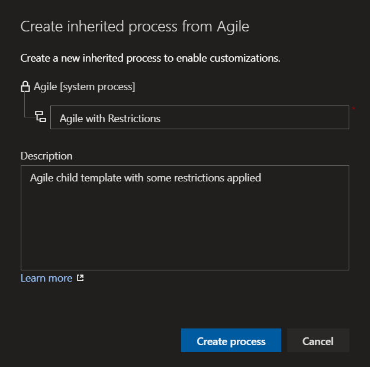
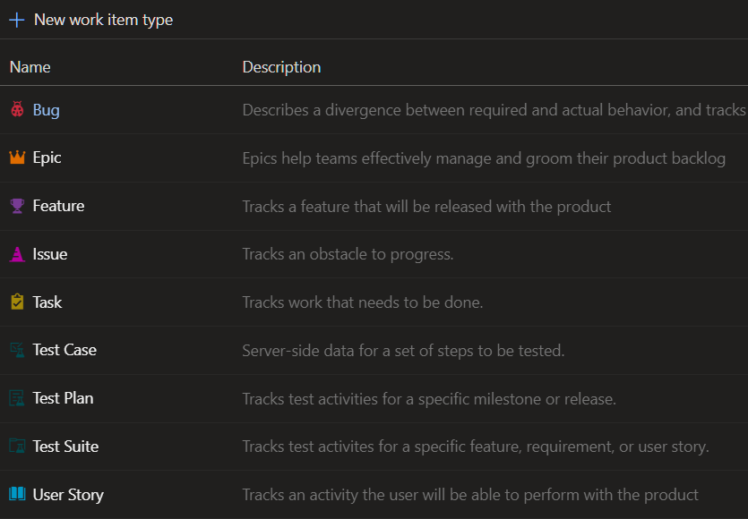
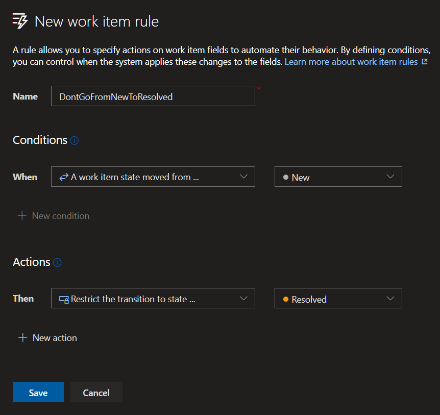

## What is State Transition Restriction Rule

Since the release of _Sprint #172_ (_official documentation: [Sprint #172 Updates](https://docs.microsoft.com/en-us/azure/devops/release-notes/2020/sprint-172-update)_) on [Azure DevOps](https://dev.azure.com), it's possible to create rules to restrict state transition of _Work Items_ on [Azure DevOps Boards](https://azure.microsoft.com/en-us/services/devops/boards/).

With this new feature, it's possible to restrict work items from being moved from one state to another directly. For example, you can restrict _Bugs_ transitioning from _New_ to _Resolved_ directly, instead, they must go from _New_ to _Active_, then they can go to _Resolved_.

## Guideline

To create a _State Transition Restriction Rule_ you need to create a new _process_ or _child process_

In this guideline, you'll find how to create an Agile Child Process and how to add a State Transition Restriction Rule into it

First, go to _Process list_ of the _Azure DevOps Organization_ (_https://dev.azure.com/{ORG&#95;NAME}/&#95;settings/process_) and create a child process, for example, from _Agile_ template...

Then, click one of the work item types;

Go to _Rules_ tab and create a new _Rule_

You can create a new _Rule_, select _"A work item state moved from ..."_ from the "_Conditions_" section, and, _"Restriction the transition to state ..."_ from the _"Actions"_ section, like this;

All of the possible _"Conditions"_;

* A work item is created ...
* A work item state changes to ...
* A work item state is not changed ... 
* A work item state changes from ...
* A work item state is ...
* A work item state is not ...
* A work item state moved from ...
* The value of ... (equals)
* The value of ... (not equals)
* A value is defined for ...
* No value is defined for ...
* A change was made to the value of ...
* No change was made to the value of ...
* Current user is member of group ...
* Current user is not member of group ...
