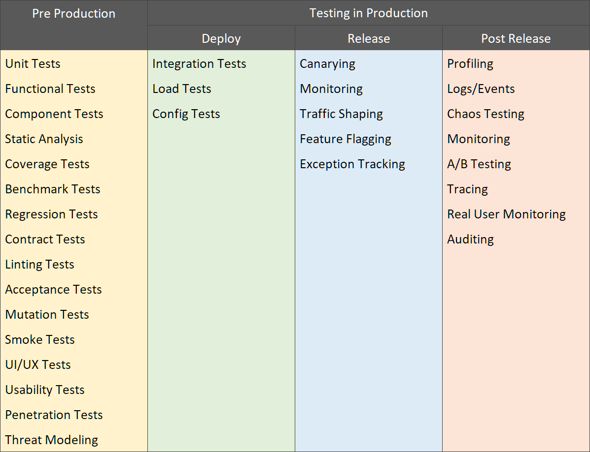

## Software Testing Types

There are different types of tests that we can use and implement in the CI/CD pipelines to make sure that changes to our code are working as expected.

_Some of the most known and used test types_

#### Unit Tests

Unit testing is a software testing method by which individual units of source code—sets of one or more computer program modules together with associated control data, usage procedures, and operating procedures—are tested to determine whether they are fit for use.

#### Integration Tests

Integration testing is the phase in software testing in which individual software modules are combined and tested as a group. Integration testing is conducted to evaluate the compliance of a system or component with specified functional requirements. It occurs after unit testing and before validation testing

#### Load Tests

Load testing generally refers to the practice of modeling the expected usage of a software program by simulating multiple users accessing the program concurrently. As such, this testing is most relevant for multi-user systems; often one built using a client/server model, such as web servers. However, other types of software systems can also be load tested.

#### UI/UX Tests

UI/UX testing is the process of testing a product's graphical user interface (_GUI_) to ensure it meets its specifications. This is normally done through the use of a variety of test cases.

#### Penetration Tests

Penetration Tests (_colloquially known as pentest or ethical hacking_), is an authorized simulated cyberattack on a computer system, performed to evaluate the security of the system.

#### A/B Tests

A/B testing is a way to compare two versions of a single variable, typically by testing a subject's response to variant A against variant B, and determining which of the two variants is more effective.

### References

* [Testing in Production by Optimizely](https://www.optimizely.com/optimization-glossary/testing-in-production/)
* [Deployment Environments by Wikipedia](https://en.wikipedia.org/wiki/Deployment_environment)
* [Unit testing by Wikipedia](https://en.wikipedia.org/wiki/Unit_testing)
* [Integration testing by Wikipedia](https://en.wikipedia.org/wiki/Integration_testing)
* [GUI testing by Wikipedia](https://en.wikipedia.org/wiki/Graphical_user_interface_testing)
* [Load testing by Wikipedia](https://en.wikipedia.org/wiki/Load_testing)
* [Penetration testing by Wikipedia](https://en.wikipedia.org/wiki/Penetration_test)
* [A/B testing by Wikipedia](https://en.wikipedia.org/wiki/A/B_testing)
* [Software Testing in the Staging Phase of Deployment by Mable](https://www.mabl.com/blog/software-testing-in-staging-phase-of-deployment)
* [Different types of software testing by Atlassian](https://www.atlassian.com/continuous-delivery/software-testing/types-of-software-testing)
* [Types Of Software Testing by Software Testing Help](https://www.softwaretestinghelp.com/types-of-software-testing/)
