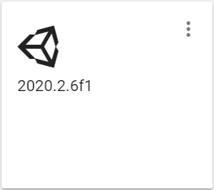
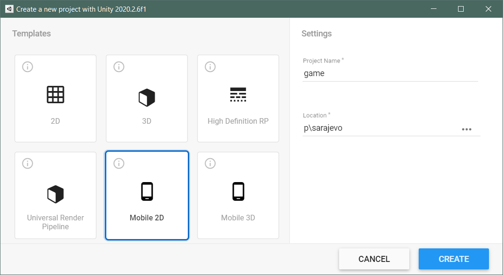
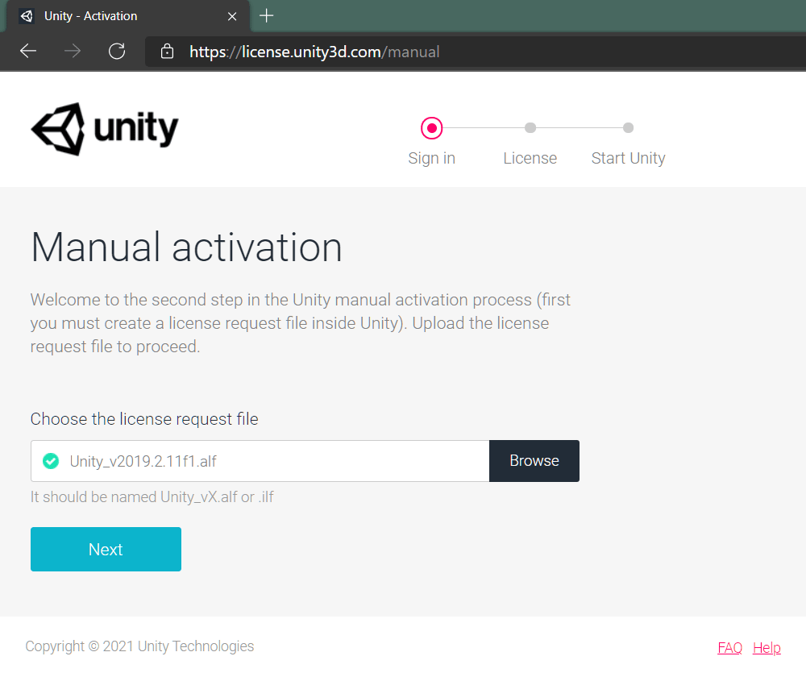

Game projects usually consist of a combination of more than one piece. Such as, game itself, a backend, a messaging platform, notification system, etc.

In this scenario, we'll create a game project with a [.Net 5.0](https://dotnet.microsoft.com/download/dotnet/5.0) backend and a [Unity3D](https://unity.com/) game project.

We'll create required _infrastructure_ resources on one of the most advanced cloud platform; [Microsoft Azure](https://azure.microsoft.com/)

And we'll store all the codes on [GitHub](https://github.com/) and apply _DevOps practices_ by creating couple of [GitHub Actions](https://github.com/features/actions) in the project.

> _TL;DR,_ you can find the _source code_, _GitHub Actions_ and _Bash scripts_ in [polatengin/sarajevo](https://github.com/polatengin/sarajevo) repo on _GitHub_

Let's start with creating the infrastructure on [Microsoft Azure](https://azure.microsoft.com/)

## Creating Infrastructure

First, to create `infra.sh` file in `.iac` folder, run the following command on terminal;

```bash
mkdir .iac && cd .iac

touch ./infra.sh

chmod +x ./infra.sh
```

_chmod_ command will give _executable_ capability to the `infra.sh` file, so we can run it by calling it (more details about _chmod_ command can be found on [chmod wikipedia page](https://en.wikipedia.org/wiki/Chmod))

```bash
./infra.sh
```

First thing first, let's create couple of variables to hold _common_ information for the `infra.sh` script;

```bash
PROJECT_NAME="sarajevo"
LOCATION="westeurope"
```

We can find the list of available locations by running the following command;

```bash
az account list-locations --output table

DisplayName               Name                 RegionalDisplayName
------------------------  -------------------  -------------------------------------
East US                   eastus               (US) East US
East US 2                 eastus2              (US) East US 2
South Central US          southcentralus       (US) South Central US
West US 2                 westus2              (US) West US 2
Australia East            australiaeast        (Asia Pacific) Australia East
Southeast Asia            southeastasia        (Asia Pacific) Southeast Asia
North Europe              northeurope          (Europe) North Europe
UK South                  uksouth              (Europe) UK South
West Europe               westeurope           (Europe) West Europe
Central US                centralus            (US) Central US
North Central US          northcentralus       (US) North Central US
West US                   westus               (US) West US
South Africa North        southafricanorth     (Africa) South Africa North
Central India             centralindia         (Asia Pacific) Central India
East Asia                 eastasia             (Asia Pacific) East Asia
Japan East                japaneast            (Asia Pacific) Japan East
Korea Central             koreacentral         (Asia Pacific) Korea Central
Canada Central            canadacentral        (Canada) Canada Central
France Central            francecentral        (Europe) France Central
Germany West Central      germanywestcentral   (Europe) Germany West Central
Norway East               norwayeast           (Europe) Norway East
Switzerland North         switzerlandnorth     (Europe) Switzerland North
UAE North                 uaenorth             (Middle East) UAE North
Brazil South              brazilsouth          (South America) Brazil South
Central US (Stage)        centralusstage       (US) Central US (Stage)
East US (Stage)           eastusstage          (US) East US (Stage)
East US 2 (Stage)         eastus2stage         (US) East US 2 (Stage)
North Central US (Stage)  northcentralusstage  (US) North Central US (Stage)
South Central US (Stage)  southcentralusstage  (US) South Central US (Stage)
West US (Stage)           westusstage          (US) West US (Stage)
West US 2 (Stage)         westus2stage         (US) West US 2 (Stage)
Asia                      asia                 Asia
Asia Pacific              asiapacific          Asia Pacific
Australia                 australia            Australia
Brazil                    brazil               Brazil
Canada                    canada               Canada
Europe                    europe               Europe
Global                    global               Global
India                     india                India
Japan                     japan                Japan
United Kingdom            uk                   United Kingdom
United States             unitedstates         United States
East Asia (Stage)         eastasiastage        (Asia Pacific) East Asia (Stage)
Southeast Asia (Stage)    southeastasiastage   (Asia Pacific) Southeast Asia (Stage)
Central US EUAP           centraluseuap        (US) Central US EUAP
East US 2 EUAP            eastus2euap          (US) East US 2 EUAP
West Central US           westcentralus        (US) West Central US
West US 3                 westus3              (US) West US 3
South Africa West         southafricawest      (Africa) South Africa West
Australia Central         australiacentral     (Asia Pacific) Australia Central
Australia Central 2       australiacentral2    (Asia Pacific) Australia Central 2
Australia Southeast       australiasoutheast   (Asia Pacific) Australia Southeast
Japan West                japanwest            (Asia Pacific) Japan West
Korea South               koreasouth           (Asia Pacific) Korea South
South India               southindia           (Asia Pacific) South India
West India                westindia            (Asia Pacific) West India
Canada East               canadaeast           (Canada) Canada East
France South              francesouth          (Europe) France South
Germany North             germanynorth         (Europe) Germany North
Norway West               norwaywest           (Europe) Norway West
Switzerland West          switzerlandwest      (Europe) Switzerland West
UK West                   ukwest               (Europe) UK West
UAE Central               uaecentral           (Middle East) UAE Central
Brazil Southeast          brazilsoutheast      (South America) Brazil Southeast
```

We need to create a [Resource Group](https://docs.microsoft.com/en-us/azure/azure-resource-manager/management/manage-resource-groups-cli) to put the project resources in it;

```bash
az group create --name "${PROJECT_NAME}-rg" --location "${LOCATION}"
```

> A resource group is a container that holds related resources for an Azure solution. The resource group can include all the resources for the solution, or only those resources that you want to manage as a group.

We can create an [App Service Plan](https://docs.microsoft.com/en-us/azure/app-service/app-service-plan-manage) by running the following command;

```bash
az appservice plan create --resource-group "${PROJECT_NAME}-rg" --name "${PROJECT_NAME}-plan" --location "${LOCATION}" --sku "FREE"
```

> An Azure App Service Plan provides the resources that an App Service App needs to run.

Only thing missing is the [App Service](https://docs.microsoft.com/en-us/azure/app-service/overview) resource itself, let's create it with the following command;

```bash
az webapp create --resource-group "${PROJECT_NAME}-rg" --plan "${PROJECT_NAME}-plan" --name "${PROJECT_NAME}-web"
```

> Azure App Service is an HTTP-based service for hosting web applications, REST APIs, and mobile back ends. You can develop in your favorite language, be it .NET, .NET Core, Java, Ruby, Node.js, PHP, or Python. Applications run and scale with ease on both Windows and Linux-based environments.

Now, we have the infra that can run the backend project.

## Creating Backend Project

To create the backend project, let's create a folder named `backend`, at the root of the solution;

```bash
mkdir backend && cd backend
```

We'll use [dotnet cli](https://docs.microsoft.com/en-us/dotnet/core/tools/) to create a `WebApi` project;

```bash
dotnet new webapi
```

> We created the backend project with the webapi template, alternatively we could use another template for the backend, such as, grpc, mvc, web, etc. More information about the templates can be found on [dotnet new arguments](https://docs.microsoft.com/en-us/dotnet/core/tools/dotnet-new#arguments) page

Based on the genre of the game, we need to add code into the _backend_ project, for the sake of simplicity of this post, we're gonna skip adding code into the backend project.

## Creating Unity3D Game Project

To create the game project, let's create a folder named `game`, at the root of the solution;

```bash
mkdir game && cd game
```

We'll use `Unity3D v2020.2.6.f1` to create the game project;



Based on the genre of the game, we can select one of the templates at the _New Game Creation Dialog_, at the time of writing this post, available options are;

- 2D
- 3D
- High Definition RP
- Universal Render Pipeline
- Mobile 2D
- Mobile 3D



After creating the game project, we need to actually develop the game, for the sake of simplicity of this post, we're gonna skip developing a game with Unity3D.

## Creating GitHub Actions

We'll use [GitHub Actions](https://github.com/features/actions) as the **orchestrator** of pipelines of this project.

Let's start with creating `.github/workflows` folder at the root of the solution;

```bash
mkdir .github/workflows && cd .github/workflows
```

### Creating GitHub Action for .Net 5 Backend Project

Create a file named `backend.yml` in the `.github/workflows` folder

```bash
touch backend.yml
```

Open `backend.yml` file with the favorite code editor (in this post we'll use [Visual Studio Code](https://code.visualstudio.com/)) and start with giving a name to our pipeline;

```yaml
name: ci_backend
```

We need to define **triggers** for the pipeline, so pipeline can be start based on an event on [GitHub](https://github.com);

```yaml
on:
  workflow_dispatch:
  push:
    branches:
      - "main"
    paths:
      - "backend/**"
```

We're using 2 _triggers_;

- [workflow_dispatch](https://docs.github.com/en/actions/reference/events-that-trigger-workflows#workflow_dispatch), so we can start the pipeline on [GitHub](https://github.com/) UI
- [push](https://docs.github.com/en/actions/reference/events-that-trigger-workflows#push), so pipeline will automatically start when there is a commit to GitHub

But, since we have `.iac`, `backend` and `game` folders, and don2t want to **build** and **deploy** backend when there is a commit to `game` folder, we add couple of filters to the `push` trigger;

- _branches_, so pipeline will start only if the _main_ branch gets a commit
- _paths_, so pipeline will start only if the listed folders have changed files

We can continue with adding _jobs_ structure to the pipeline, so we can define what type of runner we'll use _under-the-hood_;

```yaml
jobs:
  deploy:
    runs-on: ubuntu-latest
    steps:
```

[GitHub](https://github.com/) provides cloud hosted runners for us, for free, to use them in our pipelines. There are a few _flavors_ we can choose;

- **Windows**: _windows-latest_, _windows-2019_
- **Ubuntu**: _ubuntu-latest_, _ubuntu-20.04_, _ubuntu-18.04_, _ubuntu-16.04_
- **MacOS**: _macos-latest_, _macos-11.0_, _macos-10.15_

_Windows_ and _Linux_ runners have the following hardware specs;

- 2-core CPU
- 7 GB of RAM memory
- 14 GB of SSD disk space

_MacOS_ runners have the following hardware specs;

- 3-core CPU
- 14 GB of RAM memory
- 14 GB of SSD disk space

More details about the hosted runners can be found on [GitHub-hosted runners](https://docs.github.com/en/actions/using-github-hosted-runners/about-github-hosted-runners) page

First step will be checking out to the branch, so, the runner will have the latest code;

```yaml
- uses: actions/checkout@v2
```

Then, we need to login to [Azure CLI](https://docs.microsoft.com/en-us/cli/azure/install-azure-cli), so we can deploy the `backend` project code to [Azure App Service](https://azure.microsoft.com/en-us/services/app-service/) resource (we provisioned the resource on [Creating Infrastructure](#Creating-Infrastructure) section)

```yaml
- name: azure cli login
  uses: azure/login@v1
  with:
    creds: ${{ secrets.AZURE_CREDENTIALS }}
```

The runner, will need to login to [Azure CLI](https://docs.microsoft.com/en-us/cli/azure/install-azure-cli) when it's started, but we don't want to leak the credentials to our [Azure Subscription](https://docs.microsoft.com/en-us/azure/cost-management-billing/manage/create-subscription)

We need to create a [Service Principal](https://docs.microsoft.com/en-us/azure/active-directory/develop/app-objects-and-service-principals) and store the **Service Principal Object** in a safe place that the runner can access.

To create the [Service Principal](https://docs.microsoft.com/en-us/cli/azure/create-an-azure-service-principal-azure-cli), we'll use [Azure CLI](https://docs.microsoft.com/en-us/cli/azure/install-azure-cli). Run the following command on your terminal;

```bash
az ad sp create-for-rbac --name "sarajevo-sp" --sdk-auth --role contributor
```

When the **Service Principal Object** created, it'll display on the terminal, like below;

```json
{
  "clientId": "<GUID>",
  "clientSecret": "<GUID>",
  "subscriptionId": "<GUID>",
  "tenantId": "<GUID>",
  "activeDirectoryEndpointUrl": "https://login.microsoftonline.com",
  "resourceManagerEndpointUrl": "https://management.azure.com/",
  "activeDirectoryGraphResourceId": "https://graph.windows.net/",
  "sqlManagementEndpointUrl": "https://management.core.windows.net:8443/",
  "galleryEndpointUrl": "https://gallery.azure.com/",
  "managementEndpointUrl": "https://management.core.windows.net/"
}
```

Copy the output and create a _Secret_ on GitHub

- Go to [https://github.com/{ACCOUNT&#95;NAME}/{REPO&#95;NAME}/settings/secrets/actions](https://github.com/polatengin/sarajevo)
- Add a new _repository secret_
- Paste the output
- Save

Please notice that the name of the _secret_ should be the same with what we're using in the **Azure CLI Login** step;

```yaml
- name: azure cli login
  uses: azure/login@v1
  with:
    creds: ${{ secrets.AZURE_CREDENTIALS }}
```

In the third step, we can set the .Net version to what we're using in the `backend` project;

```yaml
- name: Setup DotNet Core
  uses: actions/setup-dotnet@v1
  with:
    dotnet-version: 5.0.x
```

In the fourth step, we can build and publish the `backend` project, so the upcoming steps can access the compiled version of it;

```yaml
- name: build
  run: |
    cd backend

    dotnet restore
    dotnet build --no-restore
    dotnet publish --configuration release --output ./published
```

In the last step, we actually publish the `backend` project to the **Azure App Service**;

```yaml
- name: Deploy to Azure
  uses: azure/webapps-deploy@v2
  with:
    app-name: "sarajevo-web"
    package: ./backend/published
```

Now, we're ready to start `backend` project pipeline, go to [https://github.com/{ACCOUNT&#95;NAME}/{REPO&#95;NAME}/actions](https://github.com/polatengin/sarajevo/actions) and click _Run workflow_ button;

<video controls style="width:100%">
  <source src="../_static/assets/2021/03/scenario-game-unity3d-2.mp4" type="video/mp4" />
</video>

### Creating GitHub Action for Unity3D Game Project

Create a file named `game.yml` in the `.github/workflows` folder

```bash
touch game.yml
```

Open `game.yml` file with the favorite code editor (in this post we'll use [Visual Studio Code](https://code.visualstudio.com/)) and start with giving a name to our pipeline;

```yaml
name: ci_game
```

We need to define **triggers** for the pipeline, so pipeline can be start based on an event on [GitHub](https://github.com);

```yaml
on:
  workflow_dispatch:
  push:
    branches:
      - "main"
    paths:
      - "game/**"
```

> You can find more detailed explanation about the triggers at the [Creating GitHub Action for .Net 5 Backend Project](#Creating-GitHub-Action-for-Net-5-Project) section of this post.

We can continue with defining the `job`;

```yaml
jobs:
  build:
    runs-on: ubuntu-latest
```

This time, we'll do something different, before starting `steps`, we'll define `strategy` to add `matrix` to the game project pipeline;

```yaml
strategy:
  fail-fast: false
  matrix:
    targetPlatform:
      - StandaloneOSX # Build a macOS standalone (Intel 64-bit).
      - StandaloneWindows # Build a Windows standalone.
      - StandaloneWindows64 # Build a Windows 64-bit standalone.
      - StandaloneLinux64 # Build a Linux 64-bit standalone.
      - iOS # Build an iOS player.
      - Android # Build an Android .apk standalone app.
      - WebGL # WebGL.
```

More detailed information about the `strategy` and `matrix` structures can be found on [Workflow syntax for GitHub Actions](https://docs.github.com/en/actions/reference/workflow-syntax-for-github-actions#jobsjob_idstrategy) page

Basically, we're telling [GitHub Action](https://github.com/features/actions) to run the `steps` for the `job` parallely for each of the items in the `targetPlatform` variable in the `matrix` node.

So, instead of running `steps` once, [GitHub Action](https://github.com/features/actions) will run the `steps` more than once (_7 times for this example, because there are 7 items in the targetPlatform variable_), but in parallel.

First step is the same first step we used in the `backend` pipeline;

```yaml
- uses: actions/checkout@v2
```

In the second step, we'll build the _Unity3D Game Project_, for each of the items in the `targetPlatform` variable in the `matrix`;

```yaml
- name: Unity - Builder
  uses: game-ci/unity-builder@v2.0-alpha-6
  env:
    UNITY_LICENSE: ${{ secrets.UNITY_LICENSE }}
  with:
    targetPlatform: ${{ matrix.targetPlatform }}
    projectPath: "game"
```

Building a Unity3D Game Project requires a Unity3D License, to get a license, we need to run the following GitHub Action steps one-time;

```yaml
- id: getManualLicenseFile
  uses: game-ci/unity-request-activation-file@v2

- uses: actions/upload-artifact@v1
  with:
    name: ${{ steps.getManualLicenseFile.outputs.filePath }}
    path: ${{ steps.getManualLicenseFile.outputs.filePath }}
```

It's better to create a seperate GitHub Action for these steps;

```yaml
name: onetime_to_get_unity3d_license
on: [ workflow_dispatch ]
jobs:
  license:
    runs-on: ubuntu-latest
    steps:
    - id: getManualLicenseFile
      uses: game-ci/unity-request-activation-file@v2
    - uses: actions/upload-artifact@v1
      with:
        name: ${{ steps.getManualLicenseFile.outputs.filePath }}
        path: ${{ steps.getManualLicenseFile.outputs.filePath }}
```

When we run this pipeline one-time, it'll create a file, named like, _Unity&#95;v2019.2.6f1.alf.zip_, we need to download and extract the file to get the _Unity&#95;v2019.2.6f1.alf_ file.

After getting the _Unity&#95;v2019.2.6f1.alf_ file, we need to visit the [Unity3D Manual License Activation Page](https://license.unity3d.com/manual) and upload the file.



When the page process the file, there'll be a button to download the license file, named like _Unity&#95;v2019.x.ulf_

Now we can open _Unity&#95;v2019.x.ulf_ file with the favorite code editor and copy its content, then we can create a new _Secret_ on GitHub

- Go to [https://github.com/{ACCOUNT&#95;NAME}/{REPO&#95;NAME}/settings/secrets/actions](https://github.com/polatengin/sarajevo)
- Add a new _repository secret_
- Paste the output
- Save

Please notice that the name of the _secret_ should be the same with what we're using in the **Unity - Builder** step;

```yaml
- name: Unity - Builder
  uses: game-ci/unity-builder@v2.0-alpha-6
  env:
    UNITY_LICENSE: ${{ secrets.UNITY_LICENSE }}
  with:
    targetPlatform: ${{ matrix.targetPlatform }}
    projectPath: "game"
```

Final step is for uploading compiled artifacts of the _Unity3D Game Project_;

```yaml
- uses: actions/upload-artifact@v2
  with:
    path: build/${{ matrix.targetPlatform }}
```

Now, we're ready to start `game` project pipeline, go to [https://github.com/{ACCOUNT&#95;NAME}/{REPO&#95;NAME}/actions](https://github.com/polatengin/sarajevo/actions) and click _Run workflow_ button;

<video controls style="width:100%">
  <source src="../_static/assets/2021/03/scenario-game-unity3d-4.mp4" type="video/mp4" />
</video>

At the end of the pipeline, we can download artifacts for all of the `targetPlatform`s, or we can add other steps into the pipeline to _sign_ and _publish_ the artifacts into stores, such as, [Microsoft Store](https://www.microsoft.com/en-us/store/apps/), [Google Play Store](https://play.google.com/store), [Apple App Store](https://www.apple.com/app-store/), etc.
