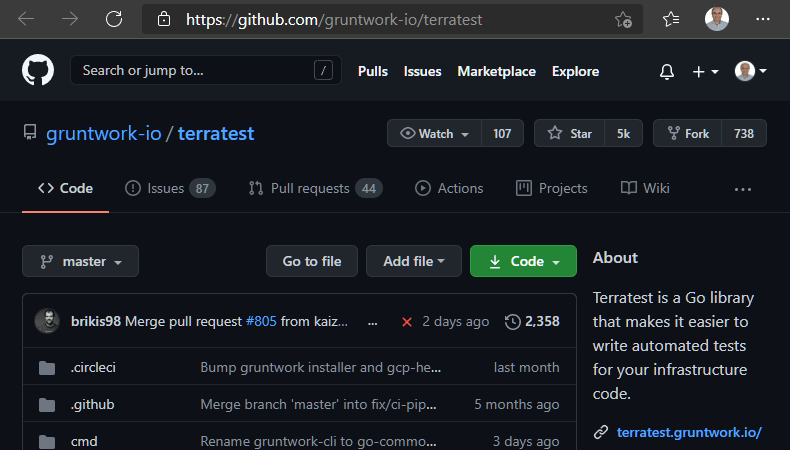
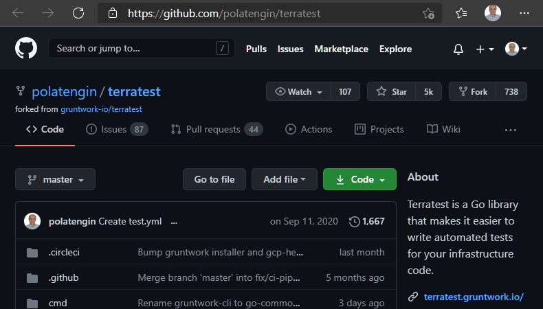
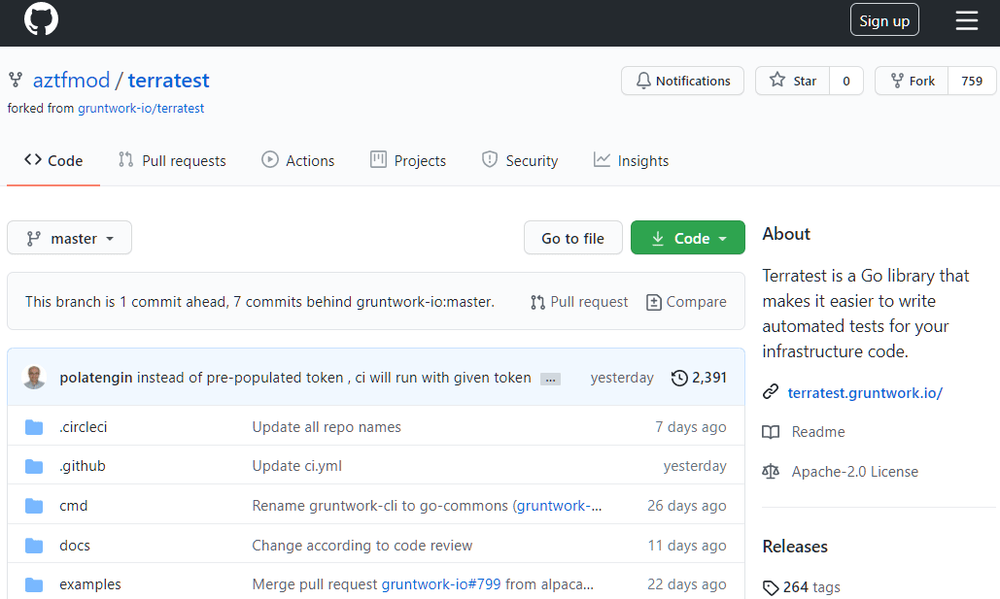
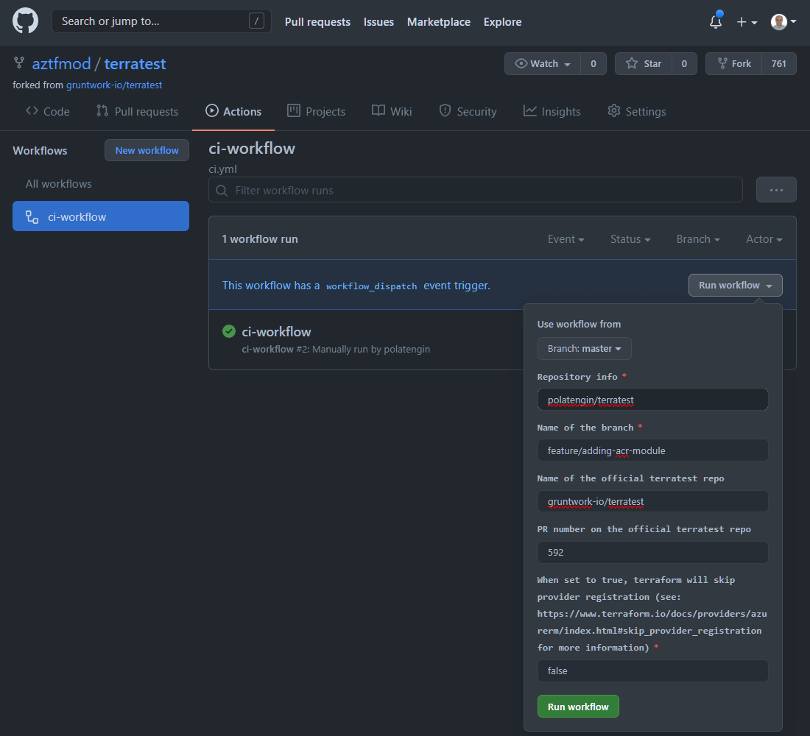

[Terratest](https://terratest.gruntwork.io/) is a [Go](https://golang.org/) library that makes it easier to write automated tests for the infrastructure code. [Terratest](https://terratest.gruntwork.io/) provides us a variety of helper functions and patterns to test our infrastructure easily.

In this post, we're gonna develop a simple [Terratest](https://terratest.gruntwork.io/) Module for [Azure Container Registry (ACR)](https://azure.microsoft.com/en-us/services/container-registry/)

We're gonna follow the steps below;

- [Fork the official repo](#Forking-the-official-repo)
- [Add the module](#Adding-the-module)
- [Run the CI workflow to test the module](#Running-the-CI-workflow-to-test-the-module)

<br />

## Forking the official repo

Let's go to the official _Terratest_ repo ([_https://github.com/gruntwork-io/terratest_](https://github.com/gruntwork-io/terratest))



_Fork_ it to your own [GitHub](https://github.com) account.



And _clone_ it to your development environment.

> If you're a _Microsoft_ employee, let [aztfmod](https://github.com/aztfmod) team (or my manager [Richard Guthrie](https://github.com/rguthriemsft), or my fellow team-mate [Hattan Shobokshi](https://github.com/hattan) or myself - [Engin Polat](https://github.com/polatengin)) know, so you can directly use [aztfmod/terratest](https://github.com/aztfmod/terratest) repo.

_We're gonna use [GitHub Codespaces](https://github.com/features/codespaces) throughout this blog post._

<video controls style="width:100%">
  <source src="../_static/assets/2021/03/terratest-acr-2.mp4" type="video/mp4" />
</video>

<br />

## Adding the module

First thing first, let's run the following command to download missing dependencies;

```bash
go mod tidy
```

Now we're ready to add the module, to do that, create a file in the `modules/` folder;

```bash
touch modules/azure/acr.go
```

_There is a subfolder for Azure related modules, `modules/azure`_

Let's put the module into the `azure` package by adding the following line at the beginning of the file;

```go
package azure
```

Start simple by creating a function that returns the `*containerregistry.Registry` structure, for given Azure Subscription Id, Resource Group Name and ACR (Azure Container Registry) Name;

```go
func GetACRClient(t *testing.T, resourceName string, resGroupName string, subscriptionID string) *containerregistry.Registry {
}
```

This function will allow [Terratest](https://terratest.gruntwork.io/) users to get the underlying `Registry` structure easily.

In the future we might need to add more functions, so let's create an _internal_ facing function that has the same signature (accepts the same parameters and return the same type);

```go
func getACRClientE(resourceName string, resGroupName string, subscriptionID string) (*containerregistry.Registry, error) {
  subscriptionID, err := getTargetAzureSubscription(subscriptionID)
  if err != nil {
    return nil, err
  }

  managedServicesClient := containerregistry.NewRegistriesClient(subscriptionID)
  authorizer, err := NewAuthorizer()

  if err != nil {
    return nil, err
  }

  managedServicesClient.Authorizer = *authorizer

  resource, err := managedServicesClient.Get(context.Background(), resGroupName, resourceName)
  if err != nil {
    return nil, err
  }

  return &resource, nil
}
```

In this function, first, we're checking if the provided subscription is valid;

```go
subscriptionID, err := getTargetAzureSubscription(subscriptionID)
if err != nil {
  return nil, err
}
```

Then creating the `Authorizer` and setting it as the `Authorizer` of the underlying service client;

```go
managedServicesClient := containerregistry.NewRegistriesClient(subscriptionID)
authorizer, err := NewAuthorizer()

if err != nil {
  return nil, err
}

managedServicesClient.Authorizer = *authorizer
```

If everything went well up until this point, we can get the Container Registry instance by calling the Get() method of the client;

```go
resource, err := managedServicesClient.Get(context.Background(), resGroupName, resourceName)
if err != nil {
  return nil, err
}

return &resource, nil
```

As a `go` rule, if the function starts with lower-case character, it means the function is _private_ and cannot be accessible from outside of the package, but if the function starts with upper-case character, it means the function is _public_ and can be accessible from outside of the package.

This is the main difference between the following function signatures;

```go
func GetACRClient(t *testing.T, resourceName string, resGroupName string, subscriptionID string) *containerregistry.Registry {
}

func getACRClientE(resourceName string, resGroupName string, subscriptionID string) (*containerregistry.Registry, error) {
}
```

Also, if function returns both the structure and an error, function name usually ends with _capital E_ character, to make it easier to see the function may return an `Error` object;

```go
func getACRClientE(resourceName string, resGroupName string, subscriptionID string) (*containerregistry.Registry, error) {
}
```

After having the _private_ function, we can call it from the _public_ function;

```go
func GetACRClient(t *testing.T, resourceName string, resGroupName string, subscriptionID string) *containerregistry.Registry {
  resource, err := getACRClientE(resourceName, resGroupName, subscriptionID)

  require.NoError(t, err)

  return resource
}
```

<br />

## Running the CI workflow to test the module

If you have access to an _Azure Subscription_ (get a free _Azure Subscription_ from: [Create your Azure free account today](https://azure.microsoft.com/en-us/free/)) you can run the CI workflow on it. If you don't have access to an _Azure Subscription_, you can run the CI workflow on [aztfmod/terratest](https://github.com/aztfmod/terratest) repo.



### Running CI workflow on your own Azure Subscription

Official [Terratest](https://terratest.gruntwork.io/) repo and [aztfmod/terratest](https://github.com/aztfmod/terratest) fork has a _GitHub Action_ in [.github/workflows/ci.yml](https://github.com/aztfmod/terratest/blob/master/.github/workflows/ci.yml) file.

If you fork one of those repos, [.github/workflows/ci.yml](https://github.com/aztfmod/terratest/blob/master/.github/workflows/ci.yml) file will be exist in your repo too.

_CI workflow_ needs the following _Secrets_ set up in the repo _Settings_;

- _AZURE&#95;CREDENTIALS_

To have permission to the Azure Subscription, to be able to provision "_terraform script under test_", you need to create a [Service Principal](https://docs.microsoft.com/en-us/cli/azure/ad/sp?view=azure-cli-latest#az_ad_sp_create_for_rbac) by executing the following script in your _Terminal_;

You can generate the credential by executing following script;

```bash
az ad sp create-for-rbac --sdk-auth --name terratest_workflow
```

Output of this command is in json format, copy and paste it in a _Secret_, named, _AZURE&#95;CREDENTIALS_

- _PAT_

When the _CI workflow_ finishes, it creates a comment in the _PR_, it's working against.

_CI workflow_ uses _PAT_ to create the comment.

To create the _PAT_, go to [Personal Access Tokens](https://github.com/settings/tokens) page under [Developer Settings](https://github.com/settings/apps) menu.

Copy the generated _PAT_, and paste it in a _Secret_, named, _PAT_

Your for is ready to run the tests now, you can use the same guideline in the next section.

### Running CI workflow on aztfmod/terratest repo

Since the _CI workflow_ has _workflow_dispatch_ trigger, you can go to GitHub Actions page and manually run the workflow.

#### Actors of the workflow

- Source repo: official terratest repo (_gruntwork-io/terratest_)
- Forked repo: (_e.g., aztfmod/terratest, polatengin/terratest_)
- PR: created from forked repo, against source repo (_gruntwork-io/terratest/pull/{PR NUMBER}_)

<br />

#### Flow of the workflow

- Developer fork the source repo
- Developer creates a branch in the forked repo
- Developer does the development 😎
- Developer creates a PR
- Developer triggers the CI workflow manually with the following values;
  - Repo: name of the forked repo (_e.g. xyz/terratest_)
  - Branch: branch name on the forked repo (_e.g. feature/adding-some-important-module_)
  - Target repository: home of the target_pr, which is the source repo (_gruntwork-io/terratest_)
  - Target PR: pr number on the source repo (_e.g. 14, 25, etc._)



### References

- [Terratest Website](https://terratest.gruntwork.io/)
- [Getting started with Terratest](https://terratest.gruntwork.io/docs/getting-started/quick-start/)
- [Terratest Documentation](https://terratest.gruntwork.io/docs/)
- [Contributing to Terratest](https://terratest.gruntwork.io/docs/community/contributing/)
