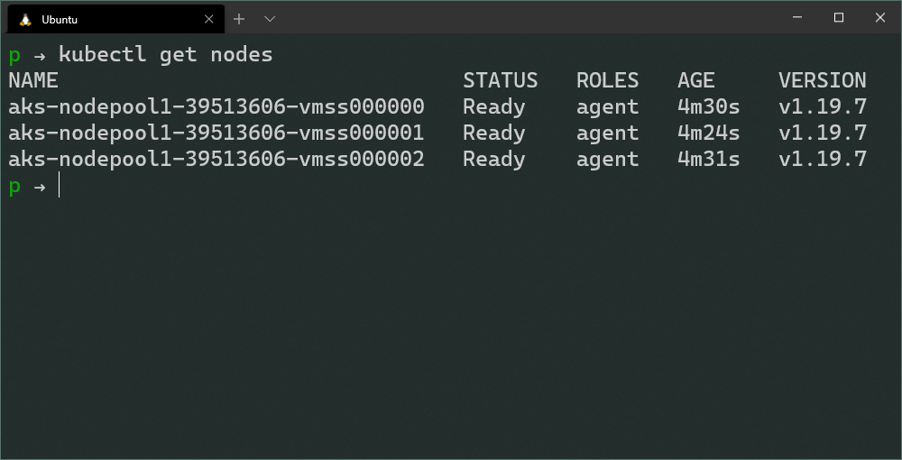
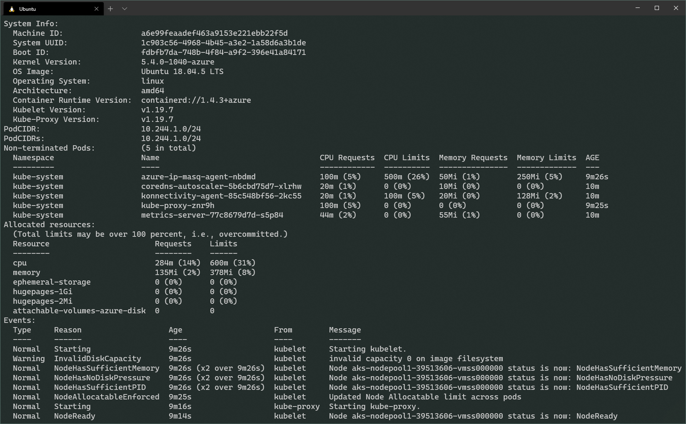
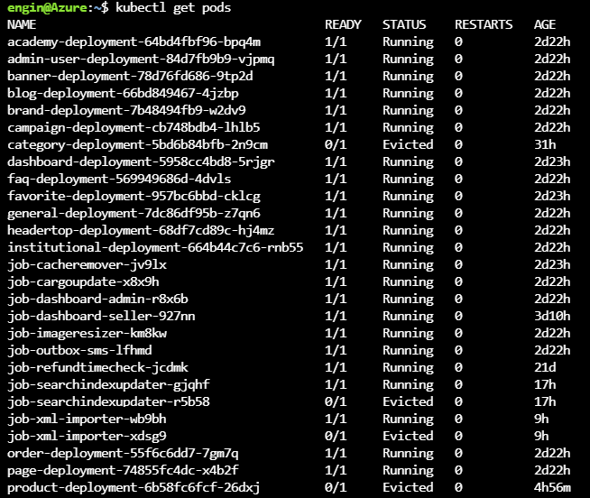
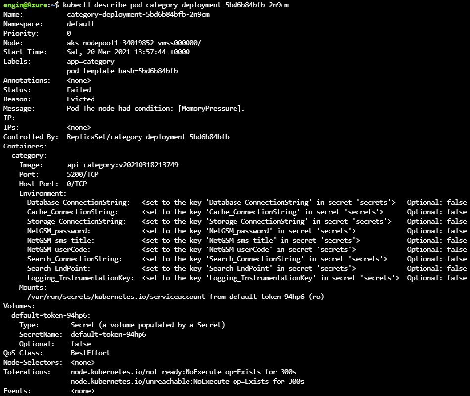

Guidelines' are always help people to ensure if they made _necessary_ checks before going deep dive.

> If your team faces the same issue more than several times, it's good to keep it recorded. So, next time, your response time will be significantly shorter. That leads happy customers 🥳

In this post you can find a _guideline_ to determine the underlying issue when there is an issue with a pod.

## Check if cluster is healthy

First thing first, let's check if the nodes are healthy. Run the following command and wait to see if all the nodes are in _Ready_ status;

```bash
kubectl get nodes
```



If some of the nodes are _not_ in the _Ready_ status, that means those _nodes_ (_or VMs if you will_) are _not_ healthy.



You can find the issue that causes the node to fail, by executing the following command;

```bash
kubectl describe node <NODE_NAME>
```

If nodes are _Ready_, check the logs, by executing the following commands;

```bash
# On Master node
cat /var/log/kube-apiserver.log # Display API Server logs
cat /var/log/kube-scheduler.log # Display Scheduler logs
cat /var/log/kube-controller-manager.log # Display Replication Manager logs

# On Worker nodes
cat /var/log/kubelet.log # Display Kubelet logs
cat /var/log/kube-proxy.log # Display KubeProxy logs
```

If nodes are healthy, continue with checking pods;

## Check if pods are healthy

Let's list the pods;

```bash
kubectl get pods
```



If you're seeing some pods are not in _Running_ state, that means, we need to focus on those pods.

Let's run the following command to see if there is a _metadata_ issue;

```bash
kubectl describe pod <POD_NAME>
```

Check the _Status_, _Reason_ and _Message_ fields first.

In the below example, we can clearly see that nodes doesn't have enough memory to run the pod.



### Eviction Reasons

- **MemoryPressure**: Available memory on the node has satisfied an eviction threshold
- **DiskPressure**: Available disk space and inodes on either the node's root filesystem or image filesystem has satisfied an eviction threshold
- **PIDPressure**: Available processes identifiers on the (Linux) node has fallen below an eviction threshold

If there is no _issue_ with the _Status_, _Reason_ and _Message_ fields, check the _Image_ field.

## Check Pod Image is correct

Somehow, your _CI/CD Pipeline_ may not be able to push the new image to the _Container Registry_, but update the _Kubernetes Pod Metadata_, so, _Kubernetes_ cannot fetch the new image and ..._will fail_.

If the image data is correct, check the integrity of _Pod Metadata_

## Check Pod Metadata Integrity

Since the pod is not running properly, let's delete it safely and validate the _Pod Metadata_ first, by executing the following command;

```bash
kubectl apply --validate -f deploy.yaml
```

If there is an issue with the metadata, `--validate` option detects the issue _before_ applying it to the _Kubernetes_.

If everything up to this point is fine, that means, pod is running, it's time to check the logs

## Check Logs of the Running Pod

Run the following command to check the logs of the running pod;

```bash
kubectl get pods

kubectl logs <POD_NAME>
```

If you don't spot any issue with the logs of the pod, connect to the pod and check the system in the pod;

## Connect to a Shell in the Container

To get a shell to the running container, execute the running command;

```bash
kubectl exec -ti <POD_NAME> -- bash
```

If the running pod doesn't have `bash`, use `sh` instead of `bash`, use the following command;

```bash
kubectl exec -ti <POD_NAME> -- sh
```

<br />

## References

- [Official Kubernetes Troubleshoot Clusters Documentation](https://kubernetes.io/docs/tasks/debug-application-cluster/debug-cluster/)
- [Configure Out of Resource Handling Documentation](https://kubernetes.io/docs/tasks/administer-cluster/out-of-resource/)
