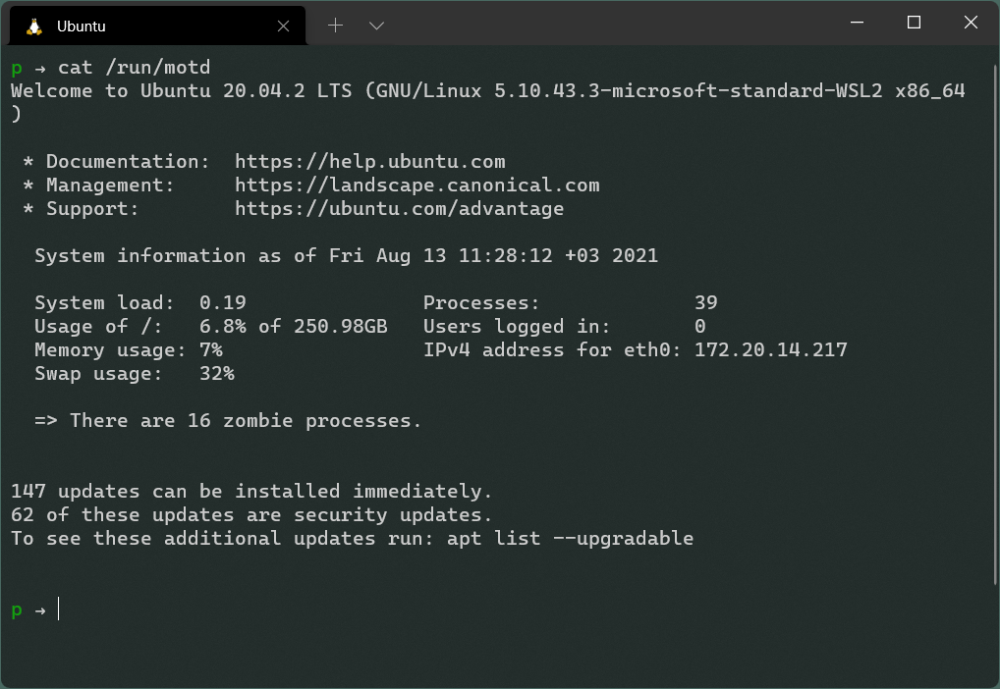

> The abbreviation _"motd"_ stands for _"message of the day"_, and this file has been traditionally used for exactly that (it requires much less disk space than mail to all users).
>
> The contents of `/run/motd` are displayed by [login](https://linux.die.net/man/1/login) after a successful _login_ but just before it executes the _login shell_.
>
> \- Ubuntu Manpage for Message of the Day

The `/run/motd` file is a text file with contents that can be displayed to all users logging in on the system. The content of the file is usually a system message, which can be used to convey information about the current state of the system to users logging in.


Execute the following command on a _Terminal_ window to display the content of `/run/motd`;

```bash
cat /run/motd
```

This file is used to display system information, to alert users of system-wide changes, or to advertise information. In some cases, system administrators might want to display specific message to users after successful login.



To disable the _"message of the day"_ prompt, execute the following command on a _Terminal_ window and create a blank `.hushlogin` file at the root folder of the current user;

```bash
touch ~/.hushlogin
```

## References

- [Ubuntu Message of the Day ManPage](https://manpages.ubuntu.com/manpages//precise/man5/motd.5.html)
