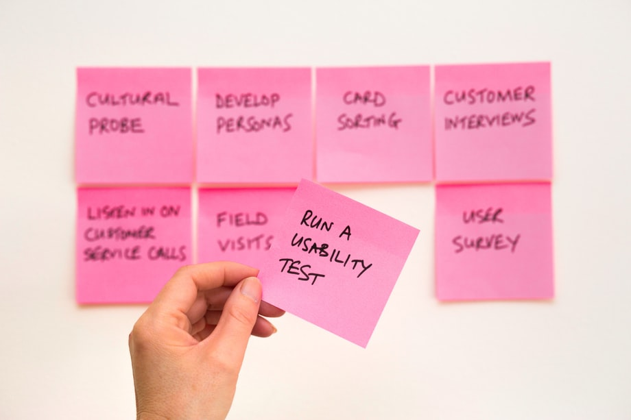

The world is moving towards a more technical future and in order to keep up with the trend, more and more people are looking to learn how to code. Coding, engineering, design and development are some of the most in demand skills in the job market today and learning how to code can help you become more employable in the real world.

## Curiosity

Remember that your job does not just stop at writing code. It’s important to know how to ask the right questions when your code isn’t working. If you have more than one idea or solution, try them all.   When you’re working on a project, you're going to have questions. You should feel comfortable asking your superiors, colleagues or clients questions about the project. In order to be a good developer, you need to be willing to experiment and explore

Once you have the information and you know what you’re doing, it’s time to get started. You may have the required skills and you may be able to right the wrongs. But there will be cases where you need to ask for help. As a developer, you need to be able to not be afraid to do it. Remember to pause and ask "why?" when something doesn’t look right, and keep digging until you find the answer.

## Analytical mindset

A developer has many skills, but the two most important ones are understanding the system and understanding the details. At the system-level, it's important to understand how the systems you're working with are put together. You need to have a deep knowledge of the topics you're working with in order to understand how they relate to the big picture. You also need to be able to balance thinking about the big picture and the details.

A developer should be someone who can think critically. A developer should have the necessary systems-level thinking skills to be able to look at a problem and come up with a plan to solve it. Even if you only have an idea about how things should work, you need to be able to think about the big picture and the small details of what that means. This type of job requires a lot of things that might not be your expertise in your daily life.

## Creativity

To me, creativity is the most important skill that a programmer can have. When you are faced with a problem, it is often the creative programmer that can come up with the best solution.

Creativity is the ability to come up with new and interesting ideas. It is the power to see old things in new ways. It lies at the heart of innovation and is a driving force behind many great discoveries. It usually involves seeing relationships or connections among things that others do not notice.

Programmers tend to be analytical and logical. The best programmers I know tend to be great at solving problems in different ways. They can break down a problem into its simplest parts and then work their way up to the final, full solution. This type of thinking is very important in programming because there are many different ways to solve a problem.

## Informed decisions

A modern developer takes a lot of responsibility. They are required to keep up with the latest changes in their areas of expertise, be it language, frameworks, or libraries. This does not mean that they have to constantly be on the hype train or jump on every new library that becomes popular in the blogs or social media. A good developer is informed, so they make informed decisions and guide the project towards the correct and future-proof direction.

It is impossible to know everything. It is important to choose your area of expertise and focus on that. When working on a team, it is important to know what you do not know, but equally important to know what your peers do know. Since most software projects are a team effort, it is important that each member of the team can complement the knowledge of their peers. This ensures that the team as a whole has a solid foundation of knowledge.

## Adaptability

For developers, jumping from one project to another is part of the job. You need to have the ability to switch contexts or the scope of a project unexpectedly, and then go back to pick up where you left off. You should always be prepared to adapt and respond to issues when they arise. This ability is important in the tech industry in particular because things can change quickly. Sometimes they change on a dime. The tech industry is unpredictable, so having the ability to adjust to the needs of your business

In the realm of tech, there are very few projects that have steps that are able to be completed one after the other without adapted or changing. As a developer, it’s important to have the ability to switch contexts or the scope of a project unexpectedly, and then go back to pick up where you left off. This is a skill that every developer should develop, because the tech industry can be unpredictable, so being able to adjust to the needs of your business or product when they change is

## Knowledge

Knowledge is crucial to being able to apply your creativity. An understanding of the why? behind how you are solving a problem is the difference between a good programmer and a great one. You should not only understand the syntax of the language you are using but also understand how and why it works the way it does.

## Efficiency

Programming is the practice of designing and building an application, software, or website with programming language. Programmers need to be able to determine what the problem is and then find a solution to it. A programmer must think logically and clearly so they can create logical codes. A good programmer must be able to write programs fast and efficiently. A good programmer must have time management skills. Programs can be tested and fixed several times, but a good programmer must have a work plan.

## Testing

Testing is a critical part of the software development lifecycle. Whether it’s done by a developer, an engineer, or a QA team, testing is incredibly important to create high-quality, bug-free products. Whether you’re building an app, a website, or a piece of hardware, testing is essential to ensure the quality of your product.

## Communication

We often work in teams, but communication is a problem. We are all different and we don't all use the same words to express ourselves. It's hard to find a common language and things can get mixed up. We need to know the language of each person and we need to learn to listen. We need to be aware when someone is saying something, or we may miss what they are saying, or they may miss what we are saying.
